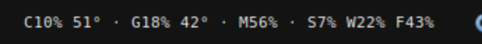
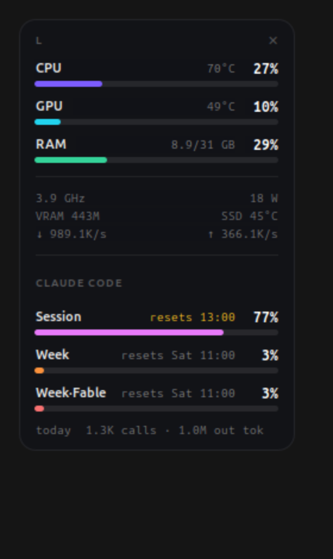
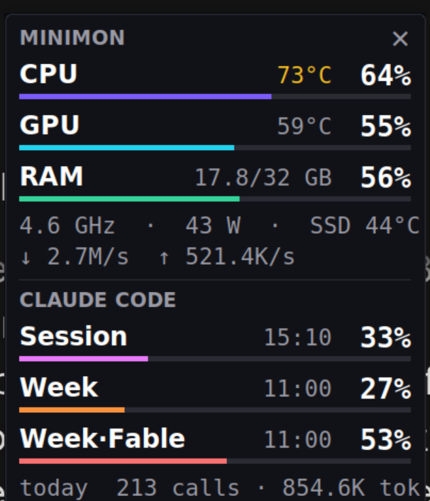

# minimon

An NZXT CAM "mini mode" style hardware + Claude Code usage monitor, for Linux
(GTK) and Windows 11 (tkinter). Shows CPU/GPU/RAM load and temps, network,
and your Claude Code rate-limit windows (session / week / per-model week) with
a local per-day call and token tally.

**Windows 11 users:** see [Windows](#windows-11) below — grab
`minimon-win-x64.exe` from the [latest release](../../releases/latest).

The Linux side comes in two interchangeable forms:

- **minimon.py** — floating always-on-top card (pure GTK3 + `/proc` + `/sys`)
- **extension/minimon@klinsc.github + minimon-daemon.py** — GNOME Shell extension
  (the autostarting default): compact live label in the top bar
  (`C4% 55° · G2% 45° · M48% · S9% W37% F38%` — CPU %/temp, GPU %/temp,
  RAM % (+temp when a DIMM sensor exists), and Claude quotas: S = session,
  W = week, F = Fable week), and clicking it
  opens a popup that reproduces the floating card in full — colored CPU/GPU/RAM
  bars, temps with warm/hot coloring, GHz/W/VRAM/SSD/net footer, and the
  Claude Session / Week / Week·Fable bars with reset times plus the today
  tally. The extension is a pure renderer; `minimon-daemon.py` (autostarted)
  reuses minimon.py's plumbing and writes `~/.cache/minimon/status.json` once
  a second. Install: copy the extension dir to
  `~/.local/share/gnome-shell/extensions/`, enable, and reload the shell
  (Alt+F2 `r` on X11).
- **minimon-bar.py** — lighter AppIndicator alternative (text-only dropdown).
  Needs `gir1.2-ayatanaappindicator3-0.1`. `--format` customizes the label
  with `{cpu} {ct} {gpu} {gt} {mem} {cc}` tokens.

## Windows 11

`minimon-win.pyw` is a self-contained floating card (tkinter + ctypes, no
third-party Python packages) that mirrors the Linux card: CPU/GPU/RAM bars with
warm/hot temp coloring, a GHz · W · SSD footer, network rates, and the Claude
Session / Week / Week·Fable bars plus today's tally.

**Install (packaged exe):**

1. Download `minimon-win-x64.exe` from the [latest release](../../releases/latest).
2. Run it, or drop it next to `install-win.ps1` and run
   `powershell -ExecutionPolicy Bypass -File install-win.ps1` to add a Startup
   shortcut and an hourly Claude-token-refresh task. `-Uninstall` reverses it.

**Run from source:** `pythonw minimon-win.pyw` (any Windows Python 3.10+;
tkinter ships with it). `--demo` renders with synthetic data on any OS.

**Where the numbers come from:**

- CPU load, RAM, network — Win32 (`GetSystemTimes`, `GlobalMemoryStatusEx`,
  `GetIfTable2`), no dependencies.
- Temperatures, GPU load/power, clocks —
  [LibreHardwareMonitor](https://github.com/LibreHardwareMonitor/LibreHardwareMonitor).
  Run it (ideally as admin) with **Options → Remote Web Server** on (port 8085);
  minimon reads its JSON, and falls back to LHM's WMI namespace. Without LHM the
  card still shows CPU/RAM/net and Claude usage, and notes `no LHM`.
- Claude usage — the same `~/.claude` files the CLI uses. Point elsewhere with
  the `MINIMON_CRED_FILE` / `MINIMON_PROJECTS` environment variables.

The x64 exe is built by [GitHub Actions](.github/workflows/build-windows.yml)
(PyInstaller on a Windows runner); push a `v*` tag to cut a release, or build
locally with `pyinstaller --onefile --windowed --name minimon-win-x64
--hidden-import minimon_core minimon-win.pyw`.

## Run (Linux)

    python3 minimon-daemon.py  # data engine for the extension (autostarts)
    python3 minimon-bar.py     # appindicator alternative
    python3 minimon.py         # floating card

## Controls

| Action | Result |
|---|---|
| Left-drag anywhere | move the widget (position is remembered) |
| Right-click | menu: snap top-right / bottom-right / quit |
| `✕`, `Esc` or `q` | quit |

## Options

    --interval SECONDS   refresh rate (default 1.0)
    --opacity 0-1        card opacity (default 0.92)
    --width PX           widget width (default 232)
    --pos X,Y            initial position

Position is stored in `~/.config/minimon.json`.

## Sensors

Discovered from `/sys/class/hwmon` at startup, so it adapts to other hardware:

| Metric | Source |
|---|---|
| CPU load / freq | `/proc/stat`, `cpufreq/scaling_cur_freq` |
| CPU temp | `k10temp` (Tctl) — falls back to `zenpower`, `coretemp`, `acpitz` |
| GPU load | `/sys/class/drm/card*/device/gpu_busy_percent` |
| GPU temp / power / VRAM | `amdgpu` hwmon + drm sysfs |
| RAM | `/proc/meminfo` (MemTotal − MemAvailable) |
| SSD temp | `nvme` hwmon (Composite) |
| RAM temp | `spd5118`/`jc42` hwmon when the DIMMs have sensors (typical DDR4 does not) |
| Network | `/proc/net/dev`, virtual interfaces filtered out |

## Claude Code usage

The bottom section mirrors the in-app usage button:

- **Session / Week / per-model weekly bars** — fetched every 2 min from the
  same `api.anthropic.com/api/oauth/usage` endpoint the usage button reads.
  Rows come from the response's `limits` array, so every window the in-app
  breakdown shows (session, weekly all-models, and scoped weeks such as
  Week·Fable) appears automatically, using
  the OAuth token in `~/.claude/.credentials.json`. The token is read fresh
  each poll and sent nowhere except api.anthropic.com. When it is expired the
  header shows `token stale` and the bars pause until it is refreshed.
- **today N calls · N out tok** — tallied locally from the transcript JSONLs
  in `~/.claude/projects/`, deduplicated by requestId, incremental byte-offset
  scan every 60 s (no network needed).

`--no-claude` hides the whole section. `MINIMON_USAGE_JSON=<file>` feeds the
bars from a JSON file instead of the API (debugging).

### Token freshness

The desktop app never rewrites the credentials file, so a systemd user timer
(`claude-token-refresh.timer`, hourly, `Persistent=true`) runs
[refresh-token.sh](refresh-token.sh): a free local check that only spends one
minimal Haiku CLI call when the token has under 90 min left (~3 calls/day).

    systemctl --user list-timers claude-token-refresh.timer   # next run
    journalctl --user -u claude-token-refresh.service         # history

To remove:

    systemctl --user disable --now claude-token-refresh.timer

## Autostart

The bundled `.desktop` files use `/path/to/minimon` in `Exec=` — edit that to
your clone path before copying one into `~/.config/autostart/`.

Installed at `~/.config/autostart/minimon-daemon.desktop` (extension data
engine, 3 s session delay). To disable:

    rm ~/.config/autostart/minimon-daemon.desktop
    gnome-extensions disable minimon@klinsc.github

Only one widget can ever run: the process holds an abstract-namespace socket
lock, so a duplicate launch prints "minimon is already running" and exits.
