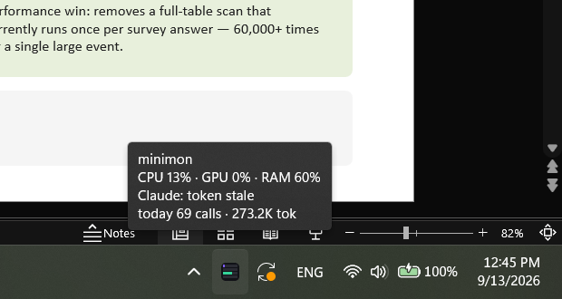

# minimon

An NZXT CAM "mini mode" style hardware + Claude Code usage monitor, for
**Linux** (GTK) and **Windows 11** (tkinter). It shows CPU / GPU / RAM load and
temperatures, network rates, and your Claude Code rate-limit windows (session /
week / per-model week) with a local per-day call and token tally — in a small
always-on-top card, and in the panel or taskbar.


Same readout on both systems:

- **Linux** — a GNOME top-bar label with a click-out popup card, a lighter
  AppIndicator dropdown, or a standalone floating card.
  
- **Windows 11** — a live label in the taskbar next to the Wi-Fi / volume /
  battery icons, plus a system-tray icon, with the floating card one click away.
  

Jump to: [Install on Windows 11](#install-on-windows-11) ·
[Install on Linux](#install-on-linux) · [Controls](#controls) ·
[Options](#command-line-options) · [Claude Code usage](#claude-code-usage) ·
[Where the numbers come from](#where-the-numbers-come-from)

---

## Install on Windows 11

### 1. Optional but recommended: LibreHardwareMonitor (for temperatures)

Windows has no unprivileged way to read CPU/GPU temperature — that needs a
kernel driver. minimon gets those numbers from
[LibreHardwareMonitor](https://github.com/LibreHardwareMonitor/LibreHardwareMonitor)
(LHM) when it is running. Without it, minimon still shows CPU / RAM / network
load and Claude usage, and quietly notes `no LHM`; temperatures, GPU load/power
and clock speed just read `--`.

1. **Install it:**

   ```
   winget install LibreHardwareMonitor.LibreHardwareMonitor
   ```

   (or download it from its
   [releases page](https://github.com/LibreHardwareMonitor/LibreHardwareMonitor/releases)).

2. **Run it as Administrator.** The sensor driver only loads with admin rights;
   started normally, most temperatures stay blank.

3. Turn on **Options → Remote Web Server** (it serves sensor JSON on
   `http://localhost:8085`). minimon reads that, and falls back to LHM's WMI
   namespace if the web server is off.

4. So it is always there, also tick **Options → Run On Windows Startup**,
   **Start Minimized**, and **Minimize To Tray**.

minimon detects LHM **live**, within a couple of seconds — you can start it
before or after minimon, in either order.

### 2. Install minimon

Grab `minimon-win-x64.exe` from the [latest release](../../releases/latest).
It is a self-contained PyInstaller build — no Python and no third-party
packages required.

- **Just run it:** double-click the exe. It appears in the taskbar (see
  [Using minimon on Windows](#using-minimon-on-windows) below).

- **Install it so it starts at login** (recommended): put the exe in a folder
  next to [`install-win.ps1`](install-win.ps1) and
  [`refresh-token.ps1`](refresh-token.ps1) from this repo, then:

  ```
  powershell -ExecutionPolicy Bypass -File install-win.ps1
  ```

  This copies the exe to `%LOCALAPPDATA%\minimon`, adds a **Startup shortcut**
  so it launches at login, registers an **hourly Claude-token-refresh task**
  (see [Token freshness](#token-freshness)), and starts it.

- **Upgrade:** download the newer exe and re-run `install-win.ps1` the same
  way — it replaces the installed copy in place and keeps the shortcut and task
  pointed at it.

- **Uninstall:** `powershell -ExecutionPolicy Bypass -File install-win.ps1 -Uninstall`
  removes the Startup shortcut and the scheduled task.

**Run from source instead:** `pythonw minimon-win.pyw` with `minimon_core.py`
alongside it. Any Windows Python 3.10+ works and tkinter ships with it; there
are no other dependencies. `--demo` renders synthetic data on any OS.

### Using minimon on Windows

minimon lives in the taskbar in two parts:

- **The readout** — the same live label the GNOME extension shows, drawn just
  left of the notification icons. The taskbar is twice as tall as the GNOME
  bar, so it is stacked as two lines like the clock beside it: hardware on top
  (`C4% 55° · G2% 45° · M48%`), Claude quotas underneath (`S9% W37% F38%` —
  **S**ession, **W**eek, per-model week such as **F**able).
- **The tray icon** — a miniature of the card (CPU, GPU, RAM and
  Claude-session meters; a meter turns red when that part is at 85 °C or hotter,
  or the session is at 90 %+), with the full numbers in its tooltip.

Both respond the same way:

- **Left-click** (or Enter/Space on the icon) toggles the floating card. `✕`,
  `Esc` and Alt+F4 hide the card back into the taskbar; **Quit** is in the menu.
- **Right-click** opens the menu: Show/Hide card, Snap top-right,
  *Always show icon in taskbar*, Quit.
- On its first run minimon pins its tray icon into the always-visible corner
  (Windows 11 otherwise hides new icons behind the `^` overflow). That is the
  *Always show icon in taskbar* toggle — the same switch as Settings ›
  Personalization › Taskbar › Other system tray icons.
- Launching the exe while it is already running just brings the card back.

It is all plain Win32 through ctypes — no third-party packages. The tray icon
is `Shell_NotifyIcon`; the readout is a layered child window parked inside the
taskbar (the technique [TrafficMonitor](https://github.com/zhongyang219/TrafficMonitor)
uses), because the taskbar exposes no text API of its own.


---

## Install on Linux

### 1. Dependencies

The card and daemon need GTK 3 and PyGObject; the AppIndicator bar also needs
the Ayatana AppIndicator typelib. Sensors are read straight from `/proc` and
`/sys/class/hwmon`, so no sensor daemon or extra package is required — the
temperatures you see depend only on which kernel hwmon drivers are loaded
(`k10temp`, `amdgpu`, `coretemp`, `nvme`, …), which is automatic on a normal
install.

- **Debian / Ubuntu:**

  ```
  sudo apt install python3-gi gir1.2-gtk-3.0
  sudo apt install gir1.2-ayatanaappindicator3-0.1   # only for minimon-bar.py
  ```

- **Fedora:**

  ```
  sudo dnf install python3-gobject gtk3
  sudo dnf install libayatana-appindicator-gtk3      # only for minimon-bar.py
  ```

### 2. Pick a form and install it

minimon comes in three interchangeable Linux front-ends. All share the same
sensor and Claude-usage plumbing.

**a) GNOME Shell extension + daemon (the autostarting default).** A compact
live label in the top bar; clicking it opens a popup that reproduces the
floating card in full. `minimon-daemon.py` (autostarted) does the reading and
writes `~/.cache/minimon/status.json` once a second; the extension is a pure
renderer.

```
cp -r extension/minimon@klinsc.github ~/.local/share/gnome-shell/extensions/
gnome-extensions enable minimon@klinsc.github
# reload the shell: Alt+F2 → r → Enter  (X11), or log out/in (Wayland)
```

Then autostart the daemon (see [Autostart on Linux](#autostart-on-linux)).

**b) Floating card** — a standalone always-on-top GTK card (no extension):

```
python3 minimon.py
```

**c) AppIndicator bar** — a lighter text-only dropdown for non-GNOME panels:

```
python3 minimon-bar.py
```

`--format` customizes its label with `{cpu} {ct} {gpu} {gt} {mem} {cc}` tokens.

### Autostart on Linux

The bundled `.desktop` files use `/path/to/minimon` in their `Exec=` line —
edit that to your clone path, then copy one into `~/.config/autostart/`. The
extension's data engine installs at
`~/.config/autostart/minimon-daemon.desktop` (3 s session delay). To disable:

```
rm ~/.config/autostart/minimon-daemon.desktop
gnome-extensions disable minimon@klinsc.github
```

Only one instance can run: it holds an abstract-namespace socket lock, so a
duplicate launch prints `minimon is already running` and exits.

---

## Controls

| Action | Result |
|---|---|
| Left-drag anywhere on the card | move it (position is remembered) |
| Right-click the card / tray icon / taskbar readout | menu (snap, quit, …) |
| `✕`, `Esc` or `q` | quit — on Windows this hides the card into the taskbar; **Quit** is in the menu |

## Command-line options

**Windows** (`minimon-win.pyw` / the exe):

| Flag | Meaning |
|---|---|
| `--interval SECONDS` | refresh rate (default 1.0) |
| `--format LINE [LINE …]` | taskbar readout, one template per line, from `{cpu} {ct} {gpu} {gt} {mem} {mt} {cc} {claude}` (default: the two-line GNOME label) |
| `--label-side {right,left}` | put the readout beside the tray icons (default) or at the taskbar's left end, if the centered app icons crowd it |
| `--no-label` | tray icon only, no taskbar readout |
| `--no-tray` | plain floating card only, no taskbar presence (`✕` quits) |
| `--hidden` | start with the card hidden (taskbar only) |
| `--demo` | synthetic sensor data (works on any OS) |

**Linux floating card** (`minimon.py`):

| Flag | Meaning |
|---|---|
| `--interval SECONDS` | refresh rate (default 1.0) |
| `--opacity 0-1` | card opacity (default 0.92) |
| `--width PX` | widget width (default 232) |
| `--pos X,Y` | initial position |
| `--no-claude` | hide the Claude Code section |

Card position is stored in `~/.config/minimon.json` (Linux) /
`%APPDATA%\minimon\config.json` (Windows).

The AppIndicator bar (`minimon-bar.py`) takes `--interval`, `--no-claude`, and
`--format` (tokens `{cpu} {ct} {gpu} {gt} {mem} {cc}`).

---

## Claude Code usage

The bottom section mirrors the in-app usage button:

- **Session / Week / per-model weekly bars** — fetched every 2 min from the
  same `api.anthropic.com/api/oauth/usage` endpoint the usage button reads.
  Rows come from the response's `limits` array, so every window the in-app
  breakdown shows (session, weekly all-models, and scoped weeks such as
  Week·Fable) appears automatically, using the OAuth token in
  `~/.claude/.credentials.json`. The token is read fresh each poll and sent
  nowhere except api.anthropic.com. When it is expired the header shows
  `token stale` and the bars pause until it is refreshed.
- **today N calls · N out tok** — tallied locally from the transcript JSONLs in
  `~/.claude/projects/`, deduplicated by requestId, an incremental byte-offset
  scan every 60 s (no network needed).

Point minimon at non-default locations with the `MINIMON_CRED_FILE` and
`MINIMON_PROJECTS` environment variables. On Linux, `--no-claude` hides the
whole section; `MINIMON_USAGE_JSON=<file>` feeds the bars from a JSON file
instead of the API (for debugging).

### Token freshness

The desktop app never rewrites the credentials file, so minimon ships a small
job that keeps the OAuth token fresh. It is a free local check that only spends
one minimal Haiku CLI call when the token has under 90 min left (~3 calls/day).

- **Windows** — `install-win.ps1` registers the hourly scheduled task
  **"minimon token refresh"** running [`refresh-token.ps1`](refresh-token.ps1).
  Inspect it with `schtasks /Query /TN "minimon token refresh"`.

- **Linux** — a systemd user timer runs [`refresh-token.sh`](refresh-token.sh):

  ```
  systemctl --user list-timers claude-token-refresh.timer   # next run
  journalctl --user -u claude-token-refresh.service         # history
  systemctl --user disable --now claude-token-refresh.timer # remove
  ```

---

## Where the numbers come from

**Windows**

| Metric | Source |
|---|---|
| CPU load, RAM, network | Win32 (`GetSystemTimes`, `GlobalMemoryStatusEx`, `GetIfTable2`) — no dependencies |
| CPU/GPU temp, GPU load/power, clock, SSD temp | LibreHardwareMonitor (HTTP on :8085, or its WMI namespace) |

**Linux** — discovered from `/sys/class/hwmon` at startup, so it adapts to your
hardware:

| Metric | Source |
|---|---|
| CPU load / freq | `/proc/stat`, `cpufreq/scaling_cur_freq` |
| CPU temp | `k10temp` (Tctl) — falls back to `zenpower`, `coretemp`, `acpitz` |
| GPU load | `/sys/class/drm/card*/device/gpu_busy_percent` |
| GPU temp / power / VRAM | `amdgpu` hwmon + drm sysfs |
| RAM | `/proc/meminfo` (MemTotal − MemAvailable) |
| SSD temp | `nvme` hwmon (Composite) |
| RAM temp | `spd5118` / `jc42` hwmon when the DIMMs have sensors (typical DDR4 does not) |
| Network | `/proc/net/dev`, virtual interfaces filtered out |

Claude usage on both systems comes from the same `~/.claude` files the CLI uses.

---

## Building the Windows exe

The x64 exe is built by [GitHub Actions](.github/workflows/build-windows.yml)
(PyInstaller on a Windows runner); push a `v*` tag to cut a release. To build
locally:

```
pyinstaller --onefile --windowed --name minimon-win-x64 \
  --hidden-import minimon_core minimon-win.pyw
```
